  <svg viewBox="0 0 800 200" xmlns="http://www.w3.org/2000/svg">
    <!-- Banner SVG content from above -->
  </svg>

# EC2 Utilization Monitoring with Slack Alerts

A robust AWS Lambda-based solution that automatically monitors EC2 instance utilization and sends real-time alerts to Slack when resource usage exceeds defined thresholds. This serverless application is deployed using AWS Serverless Application Model (SAM), ensuring consistent and reproducible infrastructure deployment.

## Overview

This solution helps DevOps teams maintain optimal EC2 performance by:
- 🔍 Continuously monitoring EC2 instance resource utilization
- ⚡ Sending immediate notifications to Slack when utilization exceeds specified thresholds
- 📊 Providing detailed metrics in notifications to facilitate quick decision-making
- ☁️ Leveraging serverless architecture to minimize operational overhead

## Architecture

```mermaid
flowchart LR
    classDef aws fill:#232F3E,stroke:#FF9900,stroke-width:2px,color:white
    classDef slack fill:#4A154B,stroke:#4A154B,stroke-width:2px,color:white
    
    EC2["fa:fa-server EC2 Instances"]:::aws
    CW["fa:fa-chart-line CloudWatch"]:::aws
    AL["fa:fa-bell Alarms"]:::aws
    LF["fa:fa-function λ Function"]:::aws
    SW["fa:fa-webhook Webhook"]:::slack
    SC["fa:fa-comment-dots Slack Channel"]:::slack
    
    EC2 -->|Metrics| CW
    CW -->|Exceeds Threshold| AL
    AL -->|Triggers| LF
    LF -->|Formats Alert| SW
    SW -->|Notification| SC
    
    subgraph AWS["fa:fa-cloud AWS Cloud"]
        EC2
        CW
        AL
        LF
    end
    
    subgraph SL["fa:fa-slack Slack Workspace"]
        SW
        SC
    end
```

[Rest of the README content remains the same...]
