# EC2 Utilization Monitoring with Slack Alerts

<div align="center">

[](https://aws.amazon.com/)
[](https://aws.amazon.com/lambda/)
[](https://aws.amazon.com/ec2/)
[](https://aws.amazon.com/serverless/sam/)
[](https://aws.amazon.com/cloudwatch/)
[](https://www.python.org/)
[](https://slack.com)

[](https://opensource.org/licenses/MIT)
[](http://makeapullrequest.com)

</div>

A robust AWS Lambda-based solution that automatically monitors EC2 instance utilization and sends real-time alerts to Slack when resource usage exceeds defined thresholds. This serverless application is deployed using AWS Serverless Application Model (SAM), ensuring consistent and reproducible infrastructure deployment.

## Overview

This solution helps DevOps teams maintain optimal EC2 performance by:
- 🔍 Continuously monitoring EC2 instance resource utilization
- ⚡ Sending immediate notifications to Slack when utilization exceeds specified thresholds
- 📊 Providing detailed metrics in notifications to facilitate quick decision-making
- ☁️ Leveraging serverless architecture to minimize operational overhead

## Architecture

```mermaid
flowchart LR
    classDef aws fill:#232F3E,stroke:#FF9900,stroke-width:2px,color:white
    classDef slack fill:#4A154B,stroke:#4A154B,stroke-width:2px,color:white
    
    EC2["fa:fa-server EC2 Instances"]:::aws
    CW["fa:fa-chart-line CloudWatch"]:::aws
    AL["fa:fa-bell Alarms"]:::aws
    LF["fa:fa-function λ Function"]:::aws
    SW["fa:fa-webhook Webhook"]:::slack
    SC["fa:fa-comment-dots Slack Channel"]:::slack
    
    EC2 -->|Metrics| CW
    CW -->|Exceeds Threshold| AL
    AL -->|Triggers| LF
    LF -->|Formats Alert| SW
    SW -->|Notification| SC
    
    subgraph AWS["fa:fa-cloud AWS Cloud"]
        EC2
        CW
        AL
        LF
    end
    
    subgraph SL["fa:fa-slack Slack Workspace"]
        SW
        SC
    end
```




# EC2 Utilization Monitoring with Slack Alerts

A robust AWS Lambda-based solution that automatically monitors EC2 instance utilization and sends real-time alerts to Slack when resource usage exceeds defined thresholds. This serverless application is deployed using AWS Serverless Application Model (SAM), ensuring consistent and reproducible infrastructure deployment.

## Overview

This solution helps DevOps teams maintain optimal EC2 performance by:
- Continuously monitoring EC2 instance resource utilization
- Sending immediate notifications to Slack when utilization exceeds specified thresholds
- Providing detailed metrics in notifications to facilitate quick decision-making
- Leveraging serverless architecture to minimize operational overhead

The solution implements the following workflow:
1. CloudWatch monitors EC2 instance metrics at regular intervals
2. When utilization exceeds the defined threshold, CloudWatch triggers the Lambda function
3. The Lambda function processes the alert and formats the message
4. A detailed notification is sent to the specified Slack channel via webhook
5. Teams can immediately respond to potential performance issues

## Features

- **Real-time Monitoring**: Continuous EC2 resource utilization tracking
- **Customizable Thresholds**: Flexible alert triggers based on your requirements
- **Detailed Notifications**: Rich Slack messages with comprehensive metrics
- **Serverless Architecture**: Low maintenance and cost-effective solution
- **Easy Deployment**: Automated deployment using AWS SAM

## Prerequisites

Before deployment, ensure you have:

- An active AWS account with appropriate IAM permissions for:
  - Lambda function creation and management
  - CloudWatch metrics and alarms
  - IAM role and policy management
  - SAM application deployment
- AWS CLI installed and configured with your credentials
- AWS SAM CLI installed (version 1.0.0 or later)
- Python 3.9 or later
- A Slack workspace with permissions to create incoming webhooks

## Installation

### 1. Clone the Repository

```bash
git clone https://github.com/Minhajms/ec2-slack-alert-lambda.git
cd ec2-slack-alert-lambda
```

### 2. Set Up the Python Environment

Navigate to the source directory and install dependencies:

```bash
cd ec2-utilization-alert/src
pip install -r requirements.txt -t .
cd ..
```

### 3. Configure the Application

Update `template.yaml` with your specific configuration:

```yaml
Globals:
  Function:
    Environment:
      Variables:
        SLACK_WEBHOOK_URL: "https://hooks.slack.com/services/YOUR/WEBHOOK/URL"
        HIGH_UTILIZATION_THRESHOLD: "80"  # Percentage threshold for alerts
        REGION: "us-east-1"  # Your desired AWS region
```

### 4. Build and Deploy

Build and deploy the application using SAM:

```bash
# Build the application
sam build

# Deploy with guided prompts
sam deploy --guided
```

During the guided deployment, you'll need to:
1. Specify a stack name (e.g., "ec2-utilization-monitor")
2. Choose your AWS region
3. Confirm the creation of required IAM roles
4. Review and confirm other deployment parameters

## Configuration Options

The solution supports several customizable parameters:

- `HIGH_UTILIZATION_THRESHOLD`: CPU utilization percentage that triggers alerts (default: 80%)
- `MONITORING_INTERVAL`: Frequency of checks in minutes (default: 5)
- `SLACK_MESSAGE_FORMAT`: Customize the alert message format using environment variables
- `INSTANCE_TAGS`: Filter specific EC2 instances by tags

## CloudWatch Alarm Setup

After deployment, set up CloudWatch alarms:

1. Navigate to CloudWatch in the AWS Console
2. Create a new alarm for EC2 metrics
3. Select the desired EC2 instance(s)
4. Choose "CPU Utilization" as the metric
5. Set the threshold to match your `HIGH_UTILIZATION_THRESHOLD`
6. Select the deployed Lambda function as the alarm action

## Testing

Verify your deployment:

1. **Manual Testing**:
   ```bash
   # Invoke the Lambda function with test data
   sam local invoke -e events/test-event.json
   ```

2. **Load Testing**:
   - Generate load on your EC2 instance(s)
   - Verify that Slack notifications are received
   - Check CloudWatch logs for function execution details

## Monitoring and Troubleshooting

Access monitoring information through:
- CloudWatch Logs for Lambda function execution logs
- CloudWatch Metrics for function performance metrics
- AWS X-Ray traces (if enabled) for detailed function analysis

Common troubleshooting steps:
1. Verify IAM roles and permissions
2. Check CloudWatch Logs for error messages
3. Confirm Slack webhook URL validity
4. Ensure EC2 instances are properly tagged (if using tag filtering)

## Cleanup

Remove all deployed resources:

```bash
sam delete
```

Verify resource deletion in the AWS Console to avoid unexpected charges.

## Contributing

Contributions are welcome! Please:

1. Fork the repository
2. Create a feature branch
3. Submit a pull request with detailed description
4. Ensure all tests pass
5. Update documentation as needed

## License

This project is licensed under the MIT License - see the LICENSE file for details.

## Resources

- [AWS Lambda Documentation](https://docs.aws.amazon.com/lambda/)
- [AWS SAM Documentation](https://docs.aws.amazon.com/serverless-application-model/)
- [Slack API Documentation](https://api.slack.com/messaging/webhooks)
- [CloudWatch Documentation](https://docs.aws.amazon.com/cloudwatch/)

---

For support, please open an issue in the GitHub repository or contact the maintenance team.
